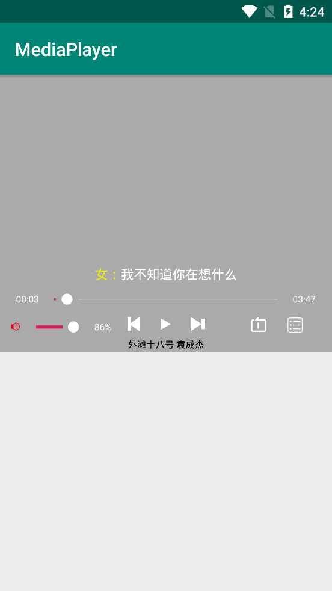
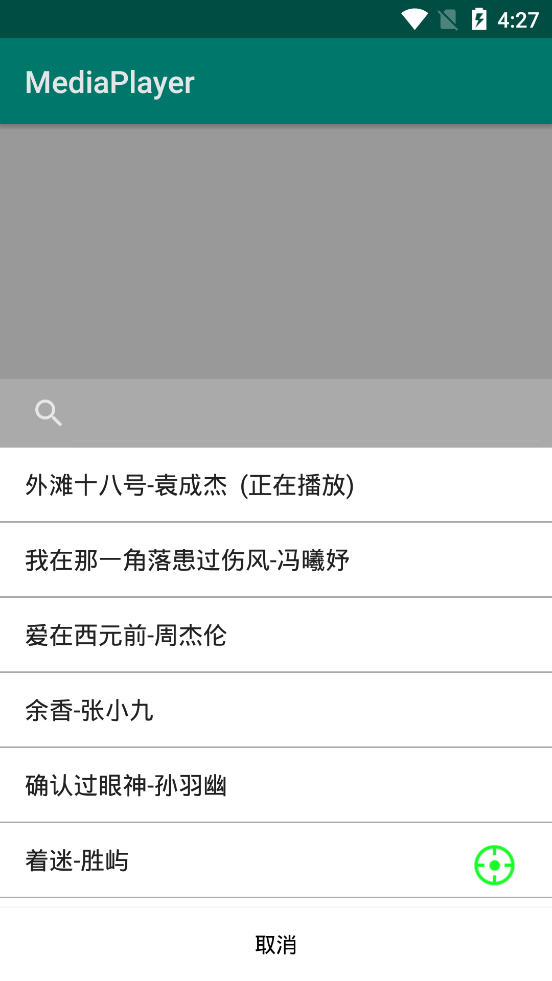

# MPController
MedoaPlayerController,基于MediaPlayer  
# Demo  


# 使用  
[](https://jitpack.io/#zbfzn/MPController)
gradle配置:  
````gradle
allprojects {
		repositories {
			...
			maven { url 'https://jitpack.io' }
		}
	}
````
````gradle
dependencies {
	        implementation 'com.github.zbfzn:MPController:#version'
	}

````

# 快速开始  
xml文件中使用：  
----
````xml
 <top.lyfzn.mpcontroller.MediaPlayerControllerView
       android:id="@+id/music_player"
       android:layout_width="match_parent"
       android:layout_height="300dp"
       app:controllerBackground="@drawable/ic_launcher_background" ><!--设置背景-->
      <!--<Button-->
          <!--android:layout_width="match_parent"-->
          <!--android:layout_height="50dp"-->
          <!--android:visibility="visible"/>-->

   </top.lyfzn.mpcontroller.MediaPlayerControllerView>
````
内嵌只允许一个子控件、子布局

java代码中简单使用
----
````java
 MediaPlayerControllerView mediaPlayerControllerView=new MediaPlayerControllerView(this);
        mediaPlayerControllerView.initPlayer(this,true);//初始化
        mediaPlayerControllerView.Play(new MediaInfo("url","tag"));//播放资源，url：地址（String），tag：标识（String）
        //parentView.addView(mediaPlayerControllerView);
````

或者  
````java
MediaPlayerControllerView mediaPlayerControllerView=findViewById(R.id.music_player);
 mediaPlayerControllerView.initPlayer(this,true);
````

# 提供的方法  
````java
    
        mediaPlayerControllerView.initPlayer(this,true);//初始化
	mediaPlayerControllerView.setControlBackground(Color.parseColor("#aaaaaa"));//设置面板背景色，也支持Drawable资源
        mediaPlayerControllerView.isPlaying();//是否正在播放
        mediaPlayerControllerView.setOnErrorAutoNext(true);//设置播放错误时自动播放下一曲，默认false
        mediaPlayerControllerView.Play(new MediaInfo("url","tag"));//播放资源，url：地址（String），tag：标识（String）
        mediaPlayerControllerView.setIsShowLrc(true);//是否显示歌词
        mediaPlayerControllerView.setIsShowPlayStatusChangeToast(true);//是否显示内置toast提示
        mediaPlayerControllerView.setPlayChangeListenser(new PlayListener() {
            @Override
            public void complete(int position) {
                //播放完成调用
            }

            @Override
            public void paused(int position) {
                //暂停播放调用
            }

            @Override
            public void beginPlay(int position) {
                //开始播放调用
            }

            @Override
            public void onError(String mediaPlayerErroMes, int what, int extra) {
                //发生错误调用
            }
        });
        mediaPlayerControllerView.addToPlayQueue(new MediaInfo("url","tag"));//添加资源到播放队列，不播放
        mediaPlayerControllerView.Play();//从第一个资源开始播放
        mediaPlayerControllerView.Play(0);//播放指定位置的，三个Play方法必须调用一个，或者直接调用ReplaceQueue
        mediaPlayerControllerView.addViewToAboveController(R.layout.dialog_layout);//添加子view
        mediaPlayerControllerView.addListToPlayQueue(list);//批量添加资源到队列，不播放
        mediaPlayerControllerView.ReplaceQueue(list);//替换当前queue，并且从0位置播放
        mediaPlayerControllerView.setChildOnBindViewListener(new OnBindPlayerViewListener() {
            @Override
            public void OnBindView(View view) {
                //子控件绑定后执行的方法
            }
        });
        mediaPlayerControllerView.Start();//继续播放
        mediaPlayerControllerView.Pause();//暂停
        mediaPlayerControllerView.Last();//播放上一个资源（上一个资源位置取决于播放模式）
        mediaPlayerControllerView.Next();//播放下一个资源（同上）
        mediaPlayerControllerView.setPlayModel(MediaPlayerControllerView.SHUNXU);//设置播放模式  SHUNXU=0,LIEBIAO=1,DANQU=2,RANDOM=3     0顺序播放,1列表循环,2单曲循环,3随机播放
        mediaPlayerControllerView.Destory();//此方法只在OnDestory中调用,用于销毁播放器
````

MediaInfo  
----
````java
//属性url,Tag,lrc
    MediaInfo mediaInfo=new MediaInfo("url","tag");//url、tag不能为空
        mediaInfo=new MediaInfo("url","tag","lrc");//lrc为字符串，可解析[00:00.00]和[00:00:00]两种格式歌词
````
# Manifest.xml  
````xml
<uses-permission android:name="android.permission.INTERNET"/><!--联网权限-->
````
